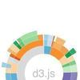
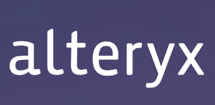

- programming language

  <u>javascript</u>

- supported browser

  <u>there is no clear identification of officially supported browsers, but the documentation recommends the usage of Chrome, Firefox and Safari. IE9 and above is also supported.</u>

- supported platform

  <u>all platforms e.g. macOS, Windows, Linux.</u>

  <u>it's independent on platform since it's browser based.</u>

- version control & issue tracking

  <u>GitHub</u>

- dependencies

  <u>Plotly is built on D3.js and stack.gl.</u>

  <u>But there is no dependecies because Plotly is an 'all-in-one' bundle with modules baked-in.</u>

  <u>But when you're using Plotly image testing framework, docker is needed.</u>

- competitors

  - <u>D3.js</u>
  - <u>Highcharts</u>
  - <u>Plottable.js</u>

- communication

  - GitHub: issue
  - twitter
  - stack overflow

- documentation

  Jekyll

- package management

  npm

- code quality

  ???

- building framework

  - webpack

    

  - browserify

  - Angular CLI

    

- testing framework

  - jasmine
  - Plotly image testing framework

- continuous integration

  CircleCI

- licensing & copyright

  - code-MIT license
  - documentation-creative commons license

- development

  - alexcjohnson
  - etpinard
  - mikolalysenko
  - dy
  - rreusser

- user

  - p&g 
  - redhat 
  - invesco 
  - alteryx

## context view

In this section, the context viewpoint Plotly.js is described. The context view describe and visualises the relationship and interactions between Plotly.js with the environment.

### system scope

according to the Plotly.js foundation, the Plotly.js is

> Built on top of [d3.js](http://d3js.org/) and [stack.gl](http://stack.gl/), plotly.js is a high-level, declarative charting library. plotly.js ships with over 30 chart types, including scientific charts, 3D graphs, statistical charts, SVG maps, financial charts, and more.

The Plotly.js is used to create sophisticated, interactive charts in JavaScript for finance, engineering, and the sciences; the targeted audience is the major companies in science, engineering and finance.

Plotly.js is Plotly written in Javascript. Plotly has wrappers or written in other languages like R and Python.

### context model

In figure1, the context model of Plotly.js is displayed. A short description of the most important entities in the diagram follows:

The project, a Javascript charting library, is mainly <u>used by</u> major companies like P&G, redhat, invesco, etc. When it comes to the programming language, Plotly,js, like its name, is almost all <u>written in</u> Javascript except some explanatory files and so on.

As Plotly.js is a Javascript library, it can be applied to many <u>browsers</u> that support it. Although there is no clear identificaiton of officially supported browser, the documentation recommend the usage of Chrome, Firefox and Safari. IE9 and above is also supported. Since Plotly.js is browser-based, it can run on almost all <u>platforms</u>.

As for the testing framework, Plotly.js provided several <u>testing</u> method.

- Jasmine test: It is run in a browser using karma.
- Image pixel comparision test/Plotly image testing framework: It's run in a docker container.

Both Jasmine testing framework and Plotly image testing framework are run on **CircleCI** on every push for <u>continuous integration</u>. However, the documentation hasn't specified which <u>code quality</u> tool they use to inspect the code quality.

To build Plotly.js, you can currently use Webpack, Browserify and Angular CLI.

As the documentation of Plotly.js states, it's based on D3.js and stack.gl. However, there is no <u>dependecies</u> since Plotly.js is an 'all-in-one' bundle with all modules baked-in. But when you're testing Plotly.js using Jasmine or Plotly image testing framework for example, Jasmine or Docker is needed. You can install Plotly.js using <u>package managers</u> like npm or use the Plotly.js CDN hosted by Fastly.

Plotly.js was instigated by Dr. Alex Johnson(alexcjohnson on GitHub) and has been in <u>development</u> for over 3 years. There are also other people contributing to this project like etpinard, mikolalysenko, dy, rreusser and other GitHub community.

As far as the <u>documentation</u> goes, it's generated and maintained by Plotly doucmentation repositoty built with Jekyll, and hosted on GitHub pages.

The competiton between Javascript charting library is fierce and Plotly.js is among the top ladder. Its <u>competitors</u> includes D3.js which has long history, Highcharts, Plottable.js and so on.

Furthermore, we also want to mention the <u>license</u> of Plotly.js. The code is released under the MIT license while the <u>copyright</u> fo the code belongs to the respective authors, and the documentation is released under the Creative Common license.

