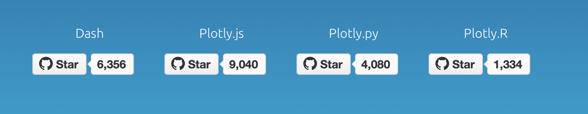
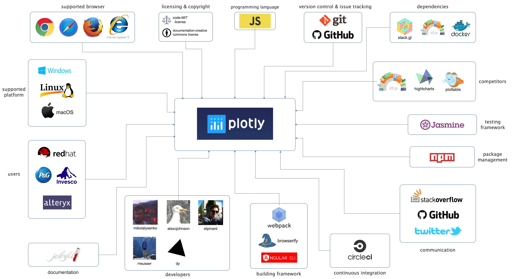
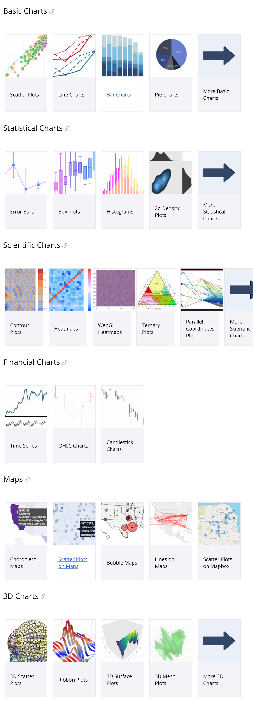
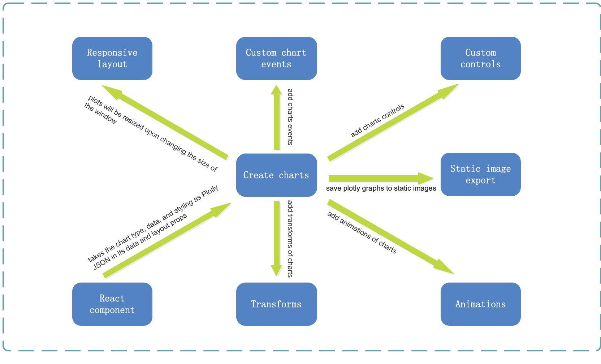
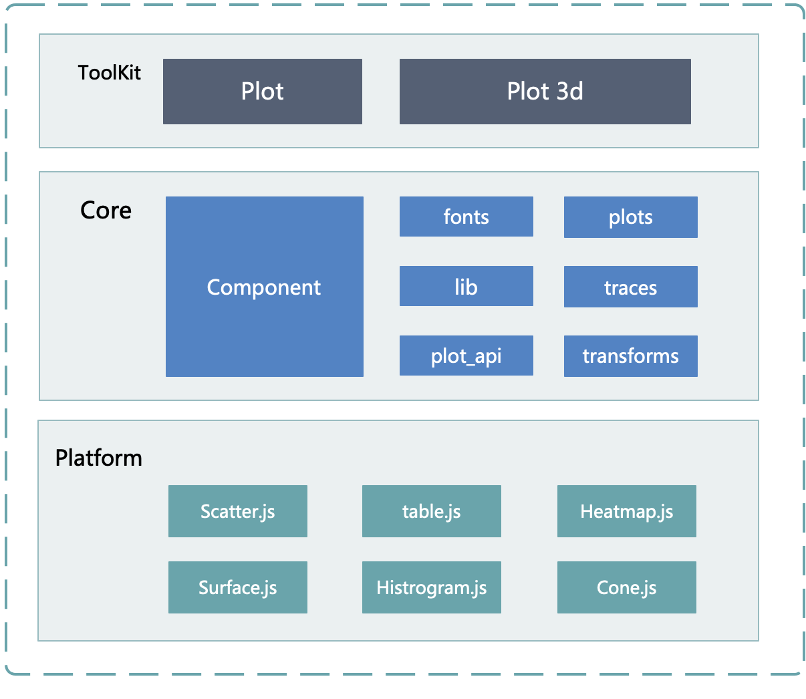
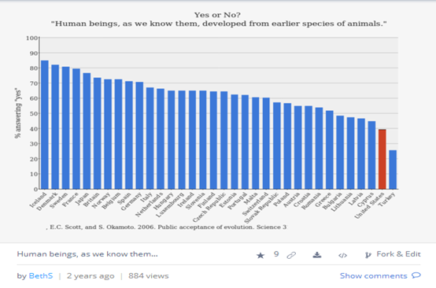
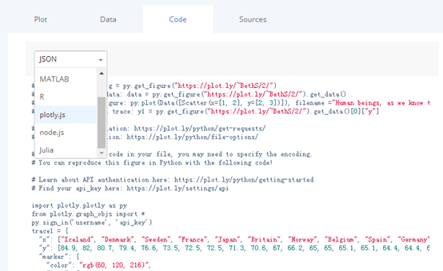
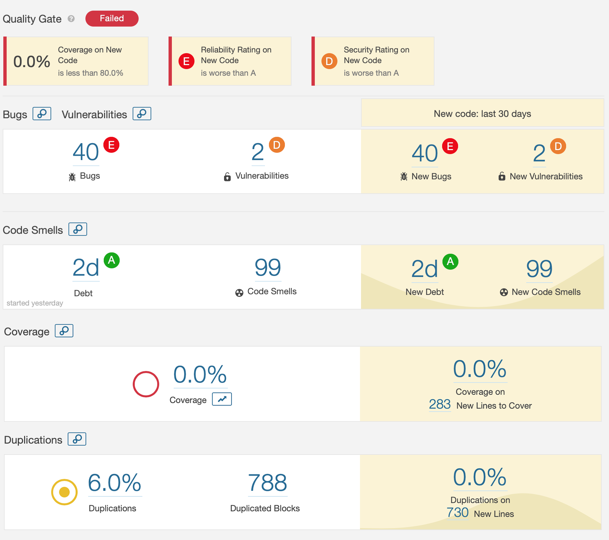
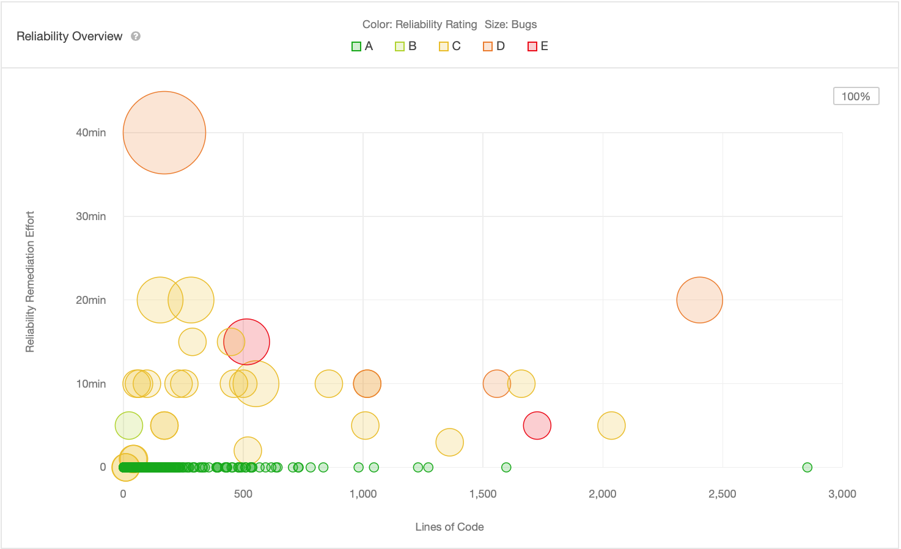
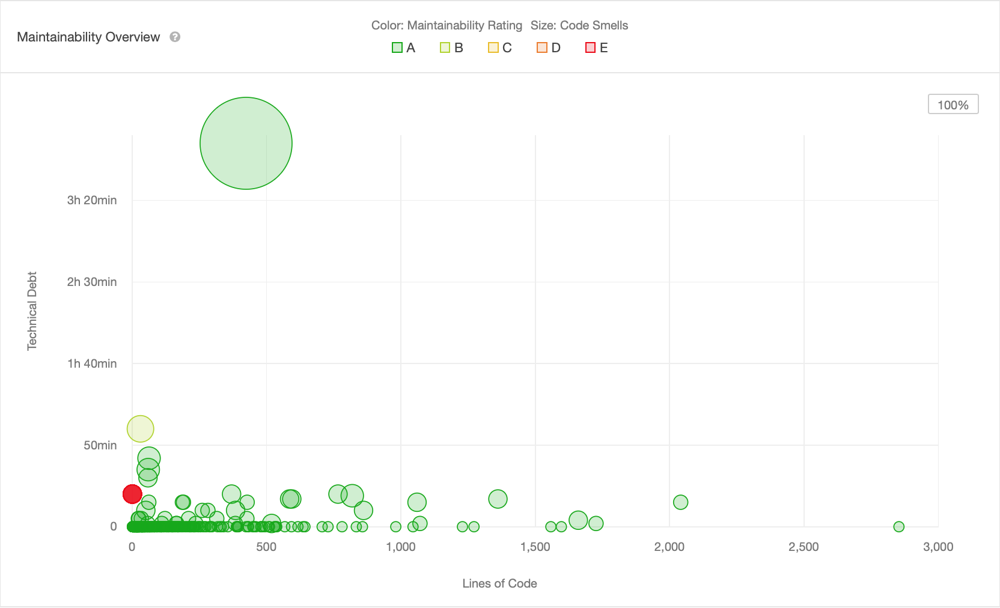

[TOC]

# Plotly.js - The open source JavaScript graphing library


##  Abstract

Built on top of d3.js[[1]](#1) and stack.gl, plotly.js is a high-level, declarative charting library. plotly.js ships with over 30 chart types, including scientific charts, 3D graphs, statistical charts, SVG maps, financial charts, and more.[[2]](#2) The open source project that started in 2015 now has 16018 commits, 112 releases made by 101 different contributors on Github. While the development is open-source, the amount of documentation about contributing is limited. This results in a project where programming is not done through conventions or guidelines but with a strong foucus on getting things to work. Therefore, this document as a whole can serve as a helpful introduction to prospectives developers looking to better understand the architecture to which thay might contribute.

## Table of Contents

- [Introduction](#Introduction)
- [Stakeholders](#Stakeholders)
- [Context View](#Context-view)
- [Functional View](#Functional-view)
- [Development View](#Development-view)
- [Performance & Scalability Perspective](#Performance--scalability-perspective)
- [Technial debt](#Technial-debt)
- [Conclusion](#Conclusion)
- [References](#References)

## Introduction

As we enter the era of big data, data analysis and data visualization technologies become particularly important. This increase demands an easy-to-use softeware to create sophisticated, interactive charts. Plotly is a technical computing company headquartered in Montreal, Quebec, that develops online data analytics and visualization tools. Plotly provides online graphing, analytics, and statistics tools for individuals and collaboration, as well as scientific graphing libraries for Python, R, MATLAB, Perl, JavaScript, Julia, Arduino, and REST[[3]](#3). As shown in Figure 1, Plotly offers a wide range of wonderful products of data analytics and visualization in different languages.



*Figure 1: Products of Plotly*

Every major company in Science, Engineering, and Finance is moving their software to the Web. Plotly provides the Web data visualization technology supporting this trend. Therefore, plotly's product for javascript, Plotly.js creates sophisticated, interactive charts in JavaScript for finance, engineering, and the sciences.

This document gives an overview of the overarching architecture of the plotly.js project. It sets the scens by introducing the project and discussing its stakeholders. It then takes on different viewpoints and perspectives as defined by Rozanski and Woods [[4]](#4) to analyse Plotly.js's performance, in addition to discussing the technical debt hidden in the depths of the codebase.

## Stakeholders
Many stakeholders are involved with Plotly.

Table 1: Summary most important stakeholders.

| Stakeholders  | Description                                                  |
| ------------- | ------------------------------------------------------------ |
| Acquirers     | The founders of Plotly are the ones that authorize funding for the products and system developement. |
| Users         | Plotly is widely used in modeling, statistics and other drawing software, users include many people and companies who need to draw visual models. |
| Testers       | Before the release of the new function, there will be a test team to test the function of the program, so as to ensure fewer mistakes. |
| Developers    | The people working on the code for the end product are both the hard- and software team. |
| Support staff | The website plays a central role in staying in tough with users that report bugs as well as happily explaining nice projects that can be built with the products. |
| Suppliers     | Partners who provide all kinds of hardware and software      |
| Maintainers   | Software solutions are assessed by the Software development team in order to maintain the programming standards and architectural choices. |

## Context View

In this section, the context viewpoint Plotly.js is described. The context view describe and visualises the relationship and interactions between Plotly.js with the environment.

### System Scope & Responsibilities

According to the [Plotly.js foundation](https://plot.ly/javascript/), the Plotly.js is

> Built on top of [D3.js](http://d3js.org/) and [stack.gl](http://stack.gl/), plotly.js is a high-level, declarative charting library. plotly.js ships with over 30 chart types, including scientific charts, 3D graphs, statistical charts, SVG maps, financial charts, and more.

The Plotly.js is used to create sophisticated, interactive charts in JavaScript for finance, engineering, and the sciences; the targeted audience is the major companies in science, engineering and finance.

It is declared in the official website of Plotly.js that Plotly.js ensures the following features:

> - Sophiscated Chart Types
> - Fully Customizable
> - High Performance
> - Fully Interactive
> - Universal

To conclude, as a interactive Javascript Graphing Library, Plotly.js has the following responsibilities:

- **Interactive**: `Plotly.js` charts are shipped with zoom, pan, hover, and click interactions. Click-and-drag to zoom into a region, double-click to autoscale, click on legend items to toggle traces. All of these events are also [exposed in the API](https://plot.ly/javascript/#chart-events).
- **Customizable**:  ```Plotly.js``` charts are described declaratively as JSON objects. Every aspect of the charts, such as colors, grid lines, and the legend, has a corresponding set of JSON attributes.
- **Universal**: By abstracting charts to a declarative JSON structure, `plotly.js` is used as a browser-based charting library for [Python](https://plot.ly/python/), [R](https://plot.ly/r/), [MATLAB](https://plot.ly/matlab/).
- **High Performance**: ```Plotly.js```uses stack.gl for high performance 2D and 3D charts. All 3D charts in `plotly.js` are rendered with [WebGL](https://www.khronos.org/registry/webgl/), leveraging the power of the GPU for fast interactivity.

Plotly.js is Plotly written in Javascript. Plotly has wrappers or written in other languages like R and Python.

### External Entities



*Figure 2: The context model of Plotly.js*

In figure2, the context model of Plotly.js is displayed. It shows the external entities and their relationships. A short description of the most important entities in the diagram follows:

The project, a Javascript charting library, is mainly <u>used by</u> major companies like [P&G](https://us.pg.com/), [RedHat](https://www.redhat.com/en), [Invesco](www.invesco.com/), [Alteryx](https://www.alteryx.com), etc. When it comes to the programming language, Plotly,js, like its name, is almost all <u>written in</u> Javascript except some explanatory files and so on.

As Plotly.js is a Javascript library, it can be applied to many <u>browsers</u> that support it. Although there is no clear identificaiton of officially supported browser, the documentation recommend the usage of Chrome, Firefox and Safari. IE9 and above is also supported. Plotly.js is built on [D3.js](https://d3js.org/) and [stack.gl](https://github.com/stackgl), but there is no <u>dependencies</u> because Ploylt.js is an 'all-in-one' bundle with modules baked-in. But when you are using the Plotly.js testing framework, [Docker](https://www.docker.com/) is needed. Since Plotly.js is browser-based, it can run on almost all <u>platforms</u>, like macOS, Windows, Linux and so on.

As for the testing framework, Plotly.js provided several <u>testing</u> method.

- [Jasmine](https://jasmine.github.io/) test: It is run in a browser using karma.
- [Image pixel comparision test/Plotly image testing framework](https://github.com/plotly/dash-image-processing): It's run in a docker container.

Both Jasmine testing framework and Plotly image testing framework are run on CircleCI on every push for <u>continuous integration</u>. However, the documentation hasn't specified which <u>code quality</u> tool they use to inspect the code quality.

To build Plotly.js, you can currently use [Webpack](https://webpack.js.org/), [Browserify](browserify.org/) and [Angular CLI](https://cli.angular.io/).

As the documentation of Plotly.js states, it's based on D3.js and stack.gl. However, there is no <u>dependecies</u> since Plotly.js is an 'all-in-one' bundle with all modules baked-in. But when you're testing Plotly.js using Jasmine or Plotly image testing framework for example, Jasmine or Docker is needed. You can install Plotly.js using <u>package managers</u> like [npm](https://www.npmjs.com/) or use the Plotly.js CDN hosted by [Fastly](https://www.fastly.com/).

Plotly.js was instigated by [@Dr. Alex Johnson](https://github.com/alexcjohnson) and has been in <u>development</u> for over 3 years. There are also other people contributing to this project like  [@Étienne Tétreault-Pinard](https://github.com/etpinard), [@Mikola Lysenko](https://github.com/mikolalysenko), [@Dmitry Yv](https://github.com/dy), [@Ricky Reusser](https://github.com/rreusser) and other GitHub community.

As far as the <u>documentation</u> goes, it's generated and maintained by Plotly doucmentation repositoty built with [Jekyll](https://jekyllrb.com/), and hosted on [GitHub Pages](https://pages.github.com/).

The competiton between Javascript charting library is fierce and Plotly.js is among the top ladder. Its <u>competitors</u> includes D3.js which has long history, Highcharts, Plottable.js and so on.

Furthermore, we also want to mention the <u>license</u> of Plotly.js. The code is released under the MIT license while the <u>copyright</u> fo the code belongs to the respective authors, and the documentation is released under the Creative Common license.

**To conclude the discription above**, a table can be drawn below:

| External Entity Name             | Content                                                      |
| -------------------------------- | ------------------------------------------------------------ |
| Programming Language             | Javascript                                                   |
| Supported Browser                | Chrome, FireFox, Safari, IE9 and above                       |
| Supported Platform               | All platforms (e.g. macOS, Windows, Linux)                   |
| Version Control & Issue Tracking | GitHub                                                       |
| Dependencies                     | Docker                                                       |
| Competitors                      | D3.js, Highcharts, Plottable.js                              |
| Communication                    | GitHub: issue, Twitter,  StackOverflow                       |
| Documentation                    | Jekyll                                                       |
| Package Management               | npm                                                          |
| Building Framework               | Webpack, Browserify, Angular CLI                             |
| Testing Framework                | Jasmine, Plotly Image Testing Framework                      |
| Continuous Integration           | CircleCI                                                     |
| Licensing & Copyright            | Code: MIT License, Documentation: Creative Common License    |
| Development                      | [@Alex Johnson](https://github.com/alexcjohnson), [@Étienne Tétreault-Pinard](https://github.com/etpinard), [@Mikola Lysenko](https://github.com/mikolalysenko), [@Dmitry Yv](https://github.com/dy), [@Ricky Reusser](https://github.com/rreusser) |
| User                             | [P&G](https://us.pg.com/), [RedHat](https://www.redhat.com/en), [Invesco](www.invesco.com/), [Alteryx](https://www.alteryx.com) |

## Functional View

According to Rozanski and Wood's book [[3]](#3),

> Describes the system’s functional elements, their responsibilities, interfaces, and primary interactions. A Functional view is the cornerstone of most ADs and is often the first part of the description that stakeholders try to read. It drives the shape of other system structures such as the information structure, concurrency structure, deployment structure, and so on. It also has a significant impact on the system’s quality properties such as its ability to change, its ability to be secured, and its runtime performance. 

In this part, main functionalities are discussed, and the functional capabilities, external interfaces and internal struture are concerned.

### Functional capabilities

Functional capabilities define what the system is required to do and whate it is not required to do[[3]](#3).  Since Plotly.js strives to create sophisticated, interactive charts, the main functionalities that it needs to have coincide with that. Table 1 shows the core functionality required of Plotly.js and describes what their responsibilities are.

| Functionality       | Description                                                  |
| ------------------- | ------------------------------------------------------------ |
| Create charts       | The main component of the system is to create chats. Plotly.js can create different types of chats for finance, engineering, and the sciences. It has 5 major categories: baisc chats, statistical chats, scientific chats,  financial chats, maps and 3D chats. See all types of chats in Figure 2. |
| Static image export | Users can save plotly graphs to static images and view them in the browser. Plotly supports jpg, png and svg image export. |
| Responsive layout   | By setting plotly.js`config` to `{ responsive: true }`, plots will be resized upon changing the size of the window. This is especially useful for mobile devices switching from portrait to landscape. |
| React component     | Users can use react-plotly.js[[5]](#5) to embed D3 charts in your React-powered web application. This React component takes the chart type, data, and styling as Plotly JSON[[6]](#6) in its data and layout props, then draws the chart using Plotly.js. |
| Transforms          | Users can use Plotly.js to do transforms like filter, groupby, aggregations and multiple transforms combining these transforms together. |
| Custom controls     | Users can use Plotly.js to do custom controls like dropdown events, button events, slider events, lasson selection and range slider and selector. |
| Custom chart events | Users can use Plotly.js to do custom chat events like click events, hover events, zoom events and disable zoom events. |
| Animations          | Users can use Plotly.js to do many animations like baisic animations, adding sliders to animations, filled-area animation and map animation. |



*Figure 2: All types of charts that Plotly.js can create.*

### External interfaces

External interfaces are the data, event, and control flows between your system and others.[[3]](#3)The external interfaces provided by Plotly.js mainly concern functinality to extension development possible. Among other things the functinality concerns plotting, layout, export  and so on. There are too many interfaces to completely list them in this report, so for a full list of available external interface refer to the [API](https://github.com/plotly/plotly.js/tree/master/src/plot_api) in `\src\plot_api`folder. As an example of what is provided, table 2 shows a brief introduction of all accessable inerfaces. With all these useful external interfaces, developers can use them to do main functionalities.

| API file                 | Description of how Plotly.js interacts with it               |
| ------------------------ | ------------------------------------------------------------ |
| plot_api.js              | Main file for main plot-creation function                    |
| plot_config.js           | Default configuration settings for Plotly.plot.              |
| plot_schema.js           | Outputs the full Plotly.js plot schema.                      |
| plot_template.js         | Creates templates of attributes objects, traces and containers. |
| subroutines.js           | Subroutines of creating plots.                               |
| to_image.js              | Export plotly graphs to static image in different types.     |
| validate.js              | Validate a data array and layout object.                     |
| template_api             | create a template off an existing figure to reuse style attributes on other figures. |
| container_array_match.js | Judge whether the arribute string points into a layout container array. |
| edit_types.js            | Edits the types of traces and layouts.                       |
| helpers.js               | Makes changes to layout, data and others before they get used for anything. |
| index.js                 | The indexes of all functional modules in plot_api folder.    |
| manage_arrays.js         | Manages arrays of layout components in relayout handles them all with a consistent interface. |

*Table 2: All of external interface and how Plotly.js interacts with them*

### Internal structure

In this part, different modules of plotly.js is described. Since Plotly.js is a javescript graphing library, all the functionalities of Plotly.js are relatively independent. Each of the different functionalities belongs to different modules, which are in table 3. And figure 3 shows how different functionalities interact with each other and how they combine together.

| Functionality       | Corresponding Module |
| ------------------- | -------------------- |
| Create charts       | plots, traces, lib   |
| Static image export | snapshot             |
| Responsive layout   | components           |
| React component     | components           |
| Transforms          | transforms, lib      |
| Custom controls     | components           |
| Custom chart events | components           |
| Animations          | components           |

*Table 3: Functionalities and their corresponding modules.*



 *Figure 3: Functional structure model*

## Development View
This particular view highlights the concerns and interests of the developers and testers of the project. The different modules in the project have been identified, the file structure has been researched and important standardizations of processes are discussed.

### Modules organization

The plotly.js source code is organized into several modules that encapsulates a coherent piece of functionality. Plotly.js modules are partitioned into three main categories as can be seen below. These modules are organized in different abstraction layers where the top layer depends on the layers below it.



 *Figure 4: Module organization model*

The **core** module comprises the core Plotly.js functionality for implementing 2D/3D plotting. The main functional components as described in the Functional View is implemented here. Most of the components like 2D annotations and 3D annotations are implemented inside the Component module. Some other important functionality are encapsulated into several other modules: fonts manipulation in fonts module; operations for plotting in plots module; gragh transformation in transforms module.

The **toolkit** module is a upper-layer module based on the core module. There are currently two major projects in this module: plot which provides overall 2 dimensional plotting operations, annotations, graphs, etc. and
plot3D which provides pseudo-3D plotting to Plotly.js.

The **platform** module consists of supporting modules from external parties such as the basic Javascript language libraries and some basic plot js files.

The diagram above can be considered as an oversimplification as the connections between modules are much more complex.

### Standardization of Design
Plotly.js is a communityeffort which is developed through [GitHub](https://www.github.com). Development standards are communicated through their [Contributing guideline](https://github.com/plotly/plotly.js/blob/master/CONTRIBUTING.md).

### Standardization of testing
The standardization of testing helps to speed up the testing process and ensures a consistent result for each newly released product. Plotly uses the following standardization of testing:
When a developer wants to contribute to Plotly, a pull-request should be made on GitHub.The developer will find the appropriate module and add the test to the test module, adding the corresponding test commands to the test script. After testing, the corresponding modules are adjusted. The software contains a large number of repeatable code blocks to make the structure clearer. When testing, it is necessary to clarify the scope of each code block and test the corresponding module again.Despite the tests written, there are still errors in the plotly project. Users feed back through official email and communication platforms, and developers retest and modify the problems reflected. Then update the software.

### Codeline organization
The codeline organization is the way that the source code is stored in a directory structure, managed via configuration management and how it is built and tested regularly [[3]](#3).In an open source project, it is important to organize the source code in a way that everyone can understand it and can add to it. An organized repository attracts enthusiastic programmers to start working on the code.

## Performance & Scalability Perspective

| Desired Quality       | The ability of the system to predictably execute within its mandated performance profile and to handle increased processing volumes |
| --------------------- | ------------------------------------------------------------ |
| Applicability         | Any system with complex, unclear, or ambitious performance requirements; systems whose architecture includes elements whose performance is unknown; and systems where future expansion is likely to be significant |
| Concerns              | Response time, throughput, scalability, predictability, hardware resource requirements, and peak load behavior |
| Activities            | Capture the performance requirements, create the performance models, analyze the performance models, conduct practical testing, assess against the requirements, and rework the architecture |
| Architectural Tactics | Optimize repeated processing, reduce contention via replication, prioritize processing, consolidate related workloads, distribute processing over time, minimize the use of shared resources, partition and parallelize, use asynchronous processing, and make design compromises |
| Problems and Pitfalls | Imprecise performance and scalability goals, unrealistic models, use of simple measures for complex cases, inappropriate partitioning, invalid environment and platform assumptions, too much indirection, concurrency-related contention, careless allocation of resources, and disregard for network and in-process invocation differences |

 	It's true that with the development of Internet and society, people rely heavier on software than ever before. Meanwhile, as the number of software users has been increasing dramatically, the concern of performance and scalability of certain software especially the software with a large number of users has been raised among a lot people.

​	This chapter discusses two related quality properties for large information systems: performance and scalability. These properties are important because, in large systems, they can cause more unexpected, complex, and expensive problems late in the system lifecycle than most of the other properties combined.

​	Intel chief Gordon Moore observed in 1965 that the processing power of computer chips doubled approximately every eighteen to twenty-four months
(now known as Moore’s Law). This remark seems to apply as much today as it  did  in  1965,  so  one  would  hope  that  by  now  performance  and  scalability would have receded as major concerns for most computer systems. Unfortunately, this isn’t the case, for a couple of reasons.

​	The most fundamental reason for performance concerns is that the tasks we  set  our  systems  to  perform  have  become  much  more  complex  over  time, and the demands we make on the systems (in terms of the complexity, number of transactions, number of users, and so on) have also grown in ways that would have been unimaginable in the 1960s.

​	To make matters worse, the performance of a computer system depends on much more than the raw processing power of its hardware. The way that hardware  is  configured,  the  way  resources  are  allocated  and  managed,  and the way the software is written can have significant impacts (good or bad) on the system’s ability to meet its performance goals. The simple fact is that we haven’t  become  much  better  at  managing  the  performance  of  our  systems since the 1960s—and we’ve actually gotten worse in some ways, such as our lack of attention to runtime memory use.

​	The scalability property of a system is closely related to performance, but rather  than  considering  how  quickly  the  system  performs  its  current  work- load, scalability focuses on the predictability of the system’s performance as the workload increases. Even if your system meets its goals today, how confident  are  you  that  it  still  will  in  the  future?  Will  it  be  able  to  cope  with  in- creased numbers of users, transactions, or messages? Will it be able to handle increased  complexity  of  processing?  How  will  it  behave  when  unexpectedly presented with a huge increase in workload? Applying the Performance and Scalability perspective to your architecture will help you answer all of these questions.	

​	We are going to discuss the performance and scalability of the powerful visualization software - Plotly, in several views as listed below.

| View        | Applicability                                                |
| ----------- | ------------------------------------------------------------ |
| Functional  | Applying this perspective may reveal the need for changes and compromises to your ideal functional structure to achieve the system’s performance requirements (e.g., by consolidating system elements to avoid communication overhead). The models from this view also provide input to the creation of performance models. |
| Information | The Information view provides useful input to performance models, identifying shared resources and the transactional requirements of each. As you apply this perspective, you may identify aspects of the Information view as obstacles to performance or scalability. In addition, considering scalability may suggest elements of the Information view that could be replicated or distributed in support of this goal. |
| Deployment  | Applying this perspective may result in changes to the concurrency design due to identifying problems such as excessive contention on key resources. Alternatively, considering performance and scalability may result in concurrency be- coming a more important design element to meet these requirements. Elements of concurrency views (such as interprocess communication mechanisms) can also provide calibration metrics for performance models. |
| Development | One of the possible outputs of applying this perspective is a set of guidelines related to performance and scalability that should be followed during software development. These guidelines will probably take the form of dos and don’ts (e.g., patterns and antipatterns) that must be followed as the software is developed in order to avoid performance and scalability problems later when it is deployed. You will capture this information in the Development view. |
| Operational | The application of this perspective highlights the need for performance monitoring and management capabilities. |

### Ⅰ：Concerns

#### Response Time

​	Response time is the length of time it takes for a specified interaction with the system to complete. For a human-oriented system, this could be the length of time between the user initiating the request and the response being available for her use (e.g., the time from clicking a user interface button to seeing the response screen populated with data). For an infrastructure-oriented system such as a database, this could be the time between invoking a service and the service  returning  a  response  (e.g.,  the  time  from  calling  a  query  application programming interface to obtaining the query results).

​	We define two broad classes of response times you may want to consider separately.

1. Responsiveness considers how quickly the system responds to routine
   workloads such as interactive user requests. The response time for such operations is typically in the order of a few seconds. The key consideration for such workloads is user productivity, ensuring that the system does not slow down its users.
2. Turnaround time is the time taken to complete (turn around) larger tasks.
   This is typically measured in minutes or hours, and the key considerations are whether the task can be completed in the time available to it and the impact the task has on the system responsiveness while it is running.

​       These  two  classes  of  response  times  can  affect  different  types  of  stake- holders and often require quite different technical solutions to make sure that requirements of each type are met.	

#### Throughput

​	Throughput is defined as the amount of workload the  system is capable of handling in a unit time period. Throughput and response time have a complex interrelationship  in  most  systems.  In  general,  the  shorter  your  transaction processing  time,  the  higher  the  throughput  your  system  can  achieve.  How- ever, as the load on the system increases (and throughput rises), the response time for individual transactions tends to increase. Therefore, it is quite possible to end up with a situation where throughput goals can be met only at the expense  of  response  time  goals,  or  vice  versa.

#### Scalability

​	Most systems are subject to workload growth in some form. Scalability is the ability of a system to handle this increased workload, which may be due to an increase in the number of requests, transactions, messages, or jobs the system is required to process per unit of time or an increase in the complexity of these tasks.

​	Long-term scalability always has an associated time element that considers how soon the increase in workload is anticipated to arrive. You may also need  to  consider  transient  scalability—that  is,  the  ability  to  handle  short bursts  of  increased  workload  (such  as  increased  traffic  to  an  Internet  news
site during an international crisis).

#### Predictability

​	In  addition  to  providing  acceptable  response  time  and  throughput,  another desirable property of a computer system is its ability to perform predictably. By this we mean that similar transactions complete in very similar amounts of time regardless of when they are executed. Similarly, the maximum transaction throughput the system can cope with should not vary significantly over time (in particular, it shouldn’t decrease).

​	Predictability is often a more desirable quality than absolute performance.

#### Hardware Resource Requirements

​	A  major  part  of  the  performance  and  scalability  puzzle  is  working  out  how much (and what type of) hardware your system will need, and this is usually an  early  concern  in  any  project,  being  captured  as  part  of  the  Deployment view. Hardware must be considered early because it costs money, takes time to acquire, often needs people to operate it, and often needs to be housed in purpose-built  environments.  The  amount  of  hardware  needed  for  a  system usually has a significant and very visible impact on its overall cost.

​	In general, more hardware means higher throughput and better response times, albeit at higher cost. Given this fundamental tension between cost and performance, your role is often to establish the minimum amount of hardware that will allow the system to meet its performance goals.	

------

### Ⅱ：Applying to Plotly.js

​	This section provides a detailed view on how the architecture of Plotly.js enables the development of highly scalable and performance as a visualization library.

#### Response Time

​	For the reason that Plotly.js is data visualization library generally used on web browser which is based on JavaScript language. So it's in fact Object-based and Event-driven. On top of that, it inherits many features from JavaScript like weak-typed, cross-platform and most importantly---fast.

​	Why can Plotly.js be so fast? I think there may be couples of reasons. Among these reasons there are good code structure and algorithms. These are actually grapes of wisdom of the Plotly.js contributors lol. However, I hold the view that the most significant reason lies in the intrinsic trait of JS. That is, as JavaScript's continuous dominance in the area of front end especially the web browser, an increasing number of web browser enterprises like Google Chrome and Firefox choose to modify their product  to improve the performance of their embedded JavaScript interpreters so that they can adapt JavaScript language better to get higher interpretation and running efficiency when coping with JS code, which also causes the change of programmers' attitude towards JavaScript who was in the past thought as inefficient and slow. So this trend leads to the great improvement of JavaScript running performance on the web browser, from which all the derived products benefit a lot, as well.

​	How much exactly do they benefit? We take the powerful JavaScript Engine--- Google V8 as an example. V8 engine made a great alteration for Interpretation of JS code, that is, it firstly compiles the JS code into machine code, then runs the machine code. In this way the browser doesn't have to interpret the JS codes every time running the codes .Instead, the repeated codes will be compiled into machine code in one time and since then be executed much faster.  Sometimes the running time can be shortened to even thousands of times.

​	This change is just like the introduction of JIT(Just in time compiler) in Java. From which the running efficiency of Java improved dramatically.

#### Throughput

​	As a relatively light-weight visualization library, there is actually nothing much to say about throughput. One thing we can say for sure is, most interaction(paragraphs of Plotly code  written on HTML) can be responded in a pretty short time.

#### Scalability

​	 As an open source visualization JS library, Plotly.js does pretty well in its scalability and maintainability.

​	Firstly, plotly supports users' customized graph types. Which means users can upload their own graph types(of course written in JavaScript). In fact, plotly.js comes with hundreds of types of graph congenitally, like Scientific graphs, revenue graphs, 3-D graphs.



*Figure 5: example: uploaded graph type by netizen*




 *Figure 6: Click on certain entities on customized graph we can see the source code*

​	So this feature dramatically increases the scalability of Plotly.js. It actually fosters a open source community for all netizen or programmers who are interested in visualization.

​	Secondly, it supports the editing of graphs interactively by your mouse or keyboard just like Excel. Just like the principle obeyed by many GUI editor : **what you see it exactly what you get**. When you edit the graph by dragging and clicking, the back end  will automatically generate the corresponding codes for you. For netizens who are not so proficient in programming but hold a enthusiastic heart for graphing and visualization, it will greatly motivates them to make some contributions to the Plotly Community.

#### Predictability

​	As for the predictability, thanks to the support from various kinds of favorable JS engines like Google v8, the processing time of repeated codes can be guaranteed in a very low level. Cuz most of your codes are the innate codes of Plotly.js library, so they will all be compiled into binary code, which can be processed in neglectable time.

​	So generally speaking, the predictability of Plotly's processing time is pretty certain and not too long.

#### Hardware Resource Requirements

​	One telling truth is, plotly.js doesn't require high-performance hardware at all. Since it's a visualization library based on JS and used in web browser, it's pretty light-weight. What's more, despite its versatile functionality, the implementation is actually not that complicated, which can be run in almost all platforms including PC, workshop, server, network.

​	As is mentioned above, lots of browsers have also made some effort to optimize the running efficiency of JS form code, so from the software perspective, it solve a lot of bottlenecks of Plotly's performance.

​	For the two reasons, nearly all users can use their device-no matter what kind of device it is, to get the graphs they want with some brief codes. what you need, are just a browser, a installed plotly.js plugin and of course, a keyboard

## Technial debt

This section focuses on the technical and testing debt present inside the Plotly.js project. The definition of technical debt according to Techopedia is: 

> Technical debt is a concept in programming that reflects the extra development work that arises when code that is easy to implement in the short run is used instead of applying the best overall solution. [[7]](#7)

To identify technical debt within Plotly.js, a wide range of options have been used. First, (static) code analysis tools are used to assess code quality. Afterwards manual inspection took place to examine the evolution of technical debt.

### SonarQube anlysis

SonarQube is a platform for continuous software quality monitoring. This platform is able to analyse a large software project like Plotly.js in a matter of minutes. It provides the user with crucial insights about bugs, security and technical debt within the project. Since we failed to run sonar scanner in `\dist` folder which contains only distribution files that are too large and have many duplications, we ran the SonarQube analysis tool on the latest version of Plotly.js ([v1.41.3](https://github.com/plotly/plotly.js/releases/tag/v1.41.3)) except for `\dist` folder. And the result has given the following insights about technical debt. SonarQube reports a large amount of bugs (40), vulnerabilities (2) and code smells (99), ranging from refactor recommendations to limiting the large number of lines in a class to the amount of duplicated code (which represents only 6.0% of the entire code base). The issues ranged from severe (Blocker) to harmless (Info) and affected almost every part of the system. See overview produced by SonarQube in figure 7.



*Figure 7: Overview produced by SonarQube of the Plotly.js project.*

The technical debt analysis however, provides a rather good insight into this phenomenon. SonarQube uses the SQALE methodology, which is a method to support the evaluation of source code independent of language or code analysis tools. It provides reliability overview and maintainability overview, which are useful to do technical debt analysis. 

See figure 8 below, the circle size is often used as a metric to assess the number of bugs. It's easily to know that When there are more bugs in a file, it takes more reliability remediation effort. Since there are some files with a large amout of bugs, the general reliability rating is E, which means there is at least one blocker bug. This insight gives indication that developers working for plotly.js should spend some time to fix serious bugs. Then, see figure 9, the circle size is often used as a metric to assess the code smells. A code smell is any characteristic in the source code of a program that possibly indicates a deeper problem.[[8]](#8) We can see the majority of the files are rating A, and only one file's maintainability rating is E. This insight gives indication that developers working for plotly.js are highly focused on generating long-term, maintainable software.



*Figure 8: Reliability Overview of Plotly.js project.*



*Figure 9: Maintainability Overview of Plotly.js project.* 

### Evolution of Technical Debt

## Conclusion

## References

1. Data-Driven Documents.org. http://d3js.org/, 2018.
2. Plotly.js. https://plot.ly/javascript/, 2018.
3. Nick Rozanski and Eoin Woods. Software Systems Architecture: Working with Stakeholders using Viewpoints and Perspectives. Addison-Wesley, 2012.
4. Wikipedia.Plotly. https://en.wikipedia.org/wiki/Plotly, 2018.
5. Github.Reat-plotly.js. https://github.com/plotly/react-plotly.js, 2018.
6. Plotly JSON. https://help.plot.ly/json-chart-schema/, 2018.
7. Technopedia. Technical debt. https://www.techopedia.com/definition/27913/technical- debt, 2017.
8. Wikipedia.Code Smell. https://en.wikipedia.org/wiki/Code_smell#cite_note-:0-1, 2018.
